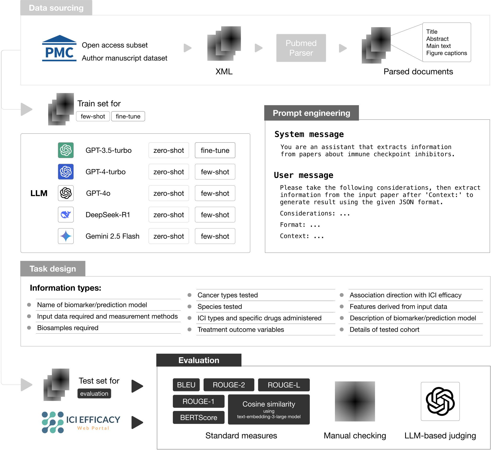

# Developing biomedical knowledgebases from the literature using large language models – a systematic assessment
This repository contains the code for reproducing all the results in the paper "Developing biomedical knowledgebases from the literature using large language models – a systematic assessment".



# 1. Clean XML
```bash
python src/xml_processing.py \
  --input-dir data/xml \
  --output-dir outputs/cleaned_xml
```

# 2. Get Responses
```bash
python src/query.py \
  --xml-dir outputs/cleaned_xml \
  --out-dir outputs/responses \
  --model 'gpt-3.5-turbo-0125' \
  --api-key 'sk-xxx' \
  --mode 'zero'
```

# 3. Evaluate
```bash
python src/metrics_evaluation.py \
  --pred 'RF16' \
  --ref '16 Feature Random Forest Classifier' \
  --api-key 'sk-xxx' \
  --out-dir outputs/score
```
